 

<!-- Snake contribution animation - "eats" your contribution graph.
     Generated automatically by the GitHub Action in .github/workflows/snake.yml -->
<picture>
  <source media="(prefers-color-scheme: dark)" srcset="https://raw.githubusercontent.com/Karang1908/Karang1908/output/github-contribution-grid-snake-dark.svg" />
  <source media="(prefers-color-scheme: light)" srcset="https://raw.githubusercontent.com/Karang1908/Karang1908/output/github-contribution-grid-snake.svg" />
  
</picture>

 

## About Me

- AI Engineer & Systems Architect — I design and ship intelligent, production-grade systems
- Currently building AI Applications and Systems that stand out
- Always exploring the edges of ML infrastructure and distributed systems

 

## 🛠️ Tech Stack

<!-- Add / remove badges freely - browse more at https://github.com/Ileriayo/markdown-badges -->

 

## 📊 GitHub Stats

 

 

 

## 📌 Pinned Repositories

 

 

## 🔗 Connect

 

